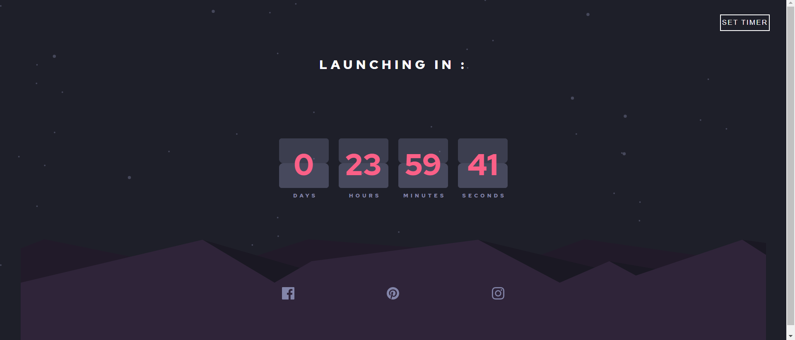
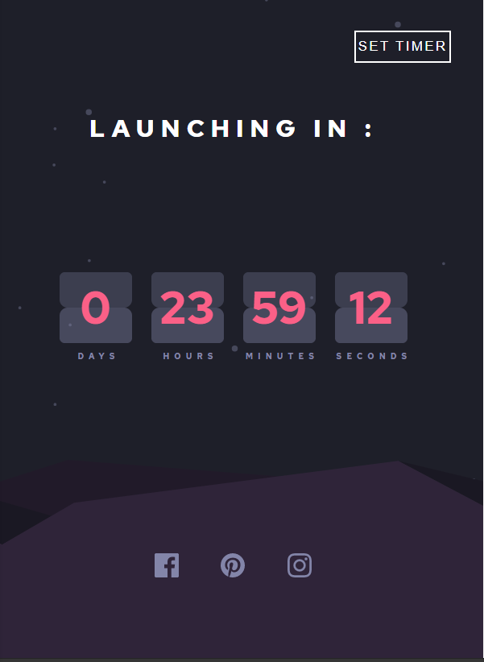

<h1 align="center" color="Mellow"></h1>

Hey Everyone , Just made this one out of curosity , design is inspired by this <a href="https://www.frontendmentor.io/challenges/launch-countdown-timer-N0XkGfyz-">site</a> . But then , I converted it into a working timer . You can set your own time using the set timer button . Have a look on this in <a href="https://sarthakjain594.github.io/Countdown-Timer/">here</a> . 
Feedbacks are welcomed !! 

<h2 align="center">Some Screenshots : </h2>

